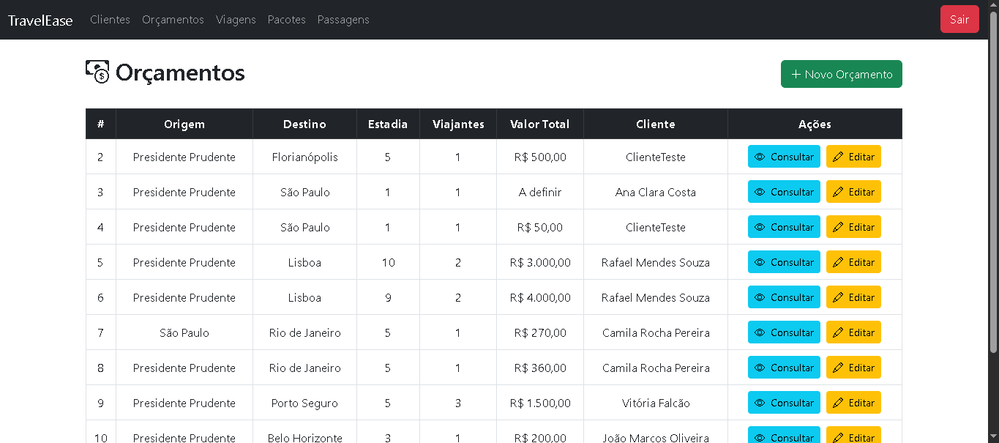
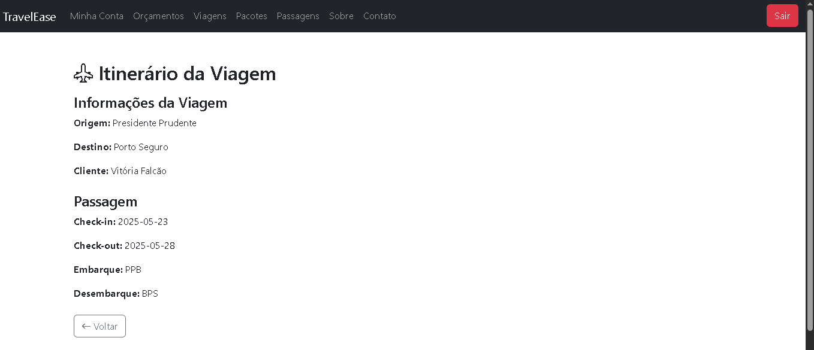

# TravelEase

## Autoras
- [Juliana Girotto Leite](https://github.com/jjgirotto)
- [Kamily de Souza Gracia](https://github.com/Kamilyszg)

## Sobre
O projeto consiste em um sistema web para gerenciamento de viagens e pacotes de viagens. A aplicação é construída com Laravel, um poderoso framework PHP, e utiliza MySQL para gerenciamento de banco de dados relacional. As funcionalidades principais do sistema incluem:

- Registro e edição de clientes
- Gerenciamento de orçamentos, viagens, passagens e pacotes de viagem
- Itinerários
- Geração de relatórios para administradores
- Encaminhamento de avisos de viagens por e-mail
- Controle de acesso por tipo de usuário (admin e cliente)

### Tipos de usuário
- **Administrador**: pode gerenciar todos os recursos do sistema.
- **Cliente**: pode visualizar viagens, orçamentos e receber avisos.

> O tipo de usuário é definido no cadastro (campo `role`), e controlado via middleware.

### Segurança
- As rotas são protegidas por autenticação via middleware.
- Apenas usuários autenticados acessam o sistema.
- Permissões são controladas por `RoleAdmMiddleware` e `RoleCliMiddleware`.

## Modelagem Entidade Relacional


## Tecnologias utilizadas
- **PHP**: Uma linguagem de programação amplamente utilizada para desenvolvimento web no lado do servidor.
- **Laravel**: Um framework PHP para construção de aplicações web modernas com sintaxe elegante, oferecendo recursos integrados como roteamento, autenticação, e gestão de banco de dados.
- **MySQL**: Sistema de gerenciamento de banco de dados relacional amplamente utilizado para armazenar e gerenciar dados em aplicações web.
- **Bootstrap**: Um framework front-end que facilita a criação de layouts responsivos e modernos, com uma vasta coleção de componentes prontos para uso, como botões, formulários, e barras de navegação.
- **HTML**: Linguagem de marcação utilizada para estruturar o conteúdo da web, permitindo a criação de páginas e componentes de interface de usuário.

**IDE: Visual Studio Code**

## Requisitos

Para utilizar o projeto na sua máquina, é necessário ter as seguintes ferramentas instaladas e configuradas:

- PHP
- Composer
- MySql ou PHPMyAdmin

## Guia de instalação

Siga os passos abaixo para baixar, configurar e executar o projeto no seu ambiente:
1. Clone o repositório:
```bash
git clone https://github.com/jjgirotto/project-travel-ease.git
cd travel-ease
composer update
```
2. Configure o arquivo `.env`: Configure as credenciais de acordo com o seu banco de dados MySQL:
```bash
DB_CONNECTION=mysql
DB_HOST=127.0.0.1
DB_PORT=3306
DB_DATABASE=nome_do_banco
DB_USERNAME=seu_usuario
DB_PASSWORD=sua_senha

MAIL_MAILER=smtp
MAIL_HOST=smtp.gmail.com
MAIL_PORT=587
MAIL_USERNAME=seu_email_gmail
MAIL_PASSWORD=sua_senha_app_gmail
MAIL_ENCRYPTION=tls
MAIL_FROM_ADDRESS=seu_email_gmail
MAIL_FROM_NAME="Seu Nome"
```
As migrações do Laravel criarão automaticamente as tabelas no MySQL. Caso haja alterações no banco de dados, utilize o comando de migração para manter a estrutura atualizada.

3. Execute as migrações e seeders do banco de dados com `php artisan migrate --seed`

4. Crie o link simbólico para os uploads (PDFs dos avisos) com `php artisan storage:link`

5. Execute o servidor local com `php artisan serve`

## Consumo
1. Ao executar `php artisan serve`, acesse o link indicado: http://127.0.0.1:8000
2. Utilize as URLS da tabela abaixo para acesso de cada endpoint.

## Endpoints

| Categoria |Método HTTP| Endpoint        | Ação                       |
|-----------|-----------|-----------------|----------------------------|
| Cliente   | POST      | /clientes/create| Cadastra um novo cliente   |
| Cliente   | PUT       | /clientes/{id}/edit/| Altera um cliente  |
| Cliente   | DELETE    | /clientes/{id}| Consulta e exclui um cliente|
| Cliente   | GET       | /clientes     | Lista todos os clientes (ADM)|
| Orçamento | POST      | /orcamentos/create| Cadastra um novo orçamento |
| Orçamento | PUT       | /orcamentos/{id}/edit/| Altera um orçamento|
| Orçamento | DELETE    | /orcamentos/{id}| Consulta e exclui um orçamento|
| Orçamento | GET       | /orcamentos   | Lista orçamentos|
| Viagem    | POST      | /viagens/create| Cadastra uma nova viagem   |
| Viagem    | PUT       | /viagens/{id}/edit/| Altera uma viagem  |
| Viagem    | DELETE    | /viagens/{id}| Consulta e exclui uma viagem|
| Viagem    | GET       | /viagens| Lista viagens|
| Viagem    | GET       | /viagens/{id}/itineraio| Detalha o itinerário|
| Pacote de viagem | POST | /pacoteViagens/create| Cadastra um novo pacote de viagem |
| Pacote de viagem | PUT | /pacoteViagens/{id}/edit/| Altera um pacote de viagem|
| Pacote de viagem | DELETE | /pacoteViagens/{id}| Consulta e exclui um pacote de viagem|
| Pacote de viagem | GET    | /pacoteViagens| Lista pacotes de viagens|
| Passagem  | POST      | /passagens/create| Cadastra uma nova passagem   |
| Passagem  | PUT       | /passagens/{id}/edit/| Altera uma passagem  |
| Passagem  | DELETE    | /passagens/{id}| Consulta e exclui uma passagem|
| Passagem  | GET       | /passagens| Lista passagens|
| Passagem  | POST      | /passagens/{id}/avisos| Envia avisos e passagens por email|
| Usuário   | POST      | /cadastro | Realiza o cadastro de novos usuários |
| Usuário   | POST      | /editar   | Realiza a alteração da senha do usuário |
| Relatório | GET       | /admin/exportar-relatorio | Exporta relatório (ADM)|
| Login     | GET/POST  | /login | Login de usuários|
| Logout    | POST      | /logout | Logout da sessão|
| Home de adm | GET       | /home-adm | Página principal do administrador|
| Home de cliente | GET       | /home-cli | Página principal do cliente|


## Demonstração





